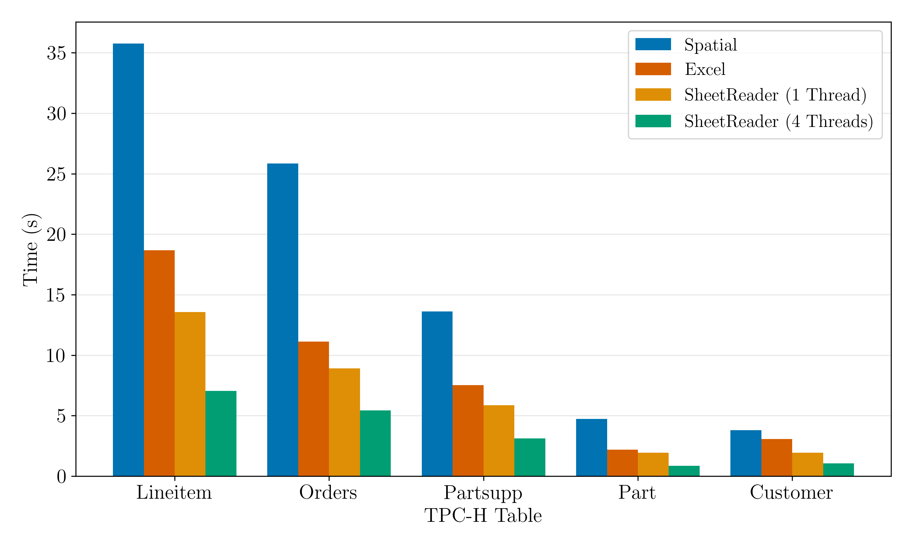

<p align="center">
  
</p>

# SheetReader DuckDB Extension: High-Speed Excel Parsing

`sheetreader` is a DuckDB extension that enables blazingly fast **Excel (XLSX)** file ingestion, optimized for **speed and memory efficiency**. It is powered by [SheetReader](https://github.com/polydbms/sheetreader-core) – a specialized spreadsheet parser designed for high-performance analytics.

<details>
<summary><b>Table of Contents</b></summary>

- [Quickstart](#quickstart)
- [Usage & Parameters](#usage--parameters)
- [Benchmarks](#benchmarks)
- [Advanced Installation](#advanced-installation)
- [Docker Sandbox](#docker-sandbox)
- [Ecosystem & Other Environments](#ecosystem--other-environments)
- [Scientific Background](#scientific-background)
</details>

## Quickstart

If you are using a standard DuckDB distribution, you can install and load the extension directly:

```sql
-- 1. Install and load
INSTALL sheetreader FROM community;
LOAD sheetreader;

-- 2. Query your Excel files immediately
SELECT * FROM sheetreader('data.xlsx');
```

## Usage & Parameters

The `sheetreader()` function allows for fine-grained control over the Excel parsing process:

```sql
CREATE TABLE my_data AS 
FROM sheetreader(
    'data.xlsx',
    sheet_index=1,        -- or sheet_name='Sales'
    threads=8,            -- parallel parsing
    has_header=TRUE,      -- specify header presence
    skip_rows=0,          -- skip empty rows at top
    coerce_to_string=TRUE -- force columns to VARCHAR
);
```

### Parameters

| Name               | Description | Type | Default |
| :----------------- | :---------- | :--: | :------ |
| `sheet_index`      | Index of the sheet (starts at 1). | `INTEGER` | `1` |
| `sheet_name`       | Name of the sheet. Cannot be used with `sheet_index`. | `VARCHAR` | `""` |
| `threads`          | Parallelism for parsing. | `INTEGER` | Cores / 2 |
| `skip_rows`        | Number of rows to skip before reading. | `INTEGER` | `0` |
| `types`            | Explicit column types: `VARCHAR`, `BOOLEAN`, `DOUBLE`, `DATE`. | `LIST(VARCHAR)` | Auto-detect |
| `coerce_to_string` | Coerce all columns to `VARCHAR`. | `BOOLEAN` | `false` |
| `force_types`      | Force specified types even if detection differs. | `BOOLEAN` | `false` |
| `has_header`       | Control header detection/usage behavior. | `BOOLEAN` | `false` |

## Benchmarks

SheetReader is optimized for speed and memory efficiency. Below is a benchmark on TPC-H tables on DuckDB version 1.4.1:


*System info: 13th Gen Intel(R) Core(TM) i7-1370P, 62GiB RAM. The benchmark data consists of TPC-H tables generated with the DuckDB TPC-H extension and written out as Excel files using the spatial extension.*

For a complete benchmark setup across many environments (DuckDB, PostgreSQL, Python, and R), please refer to the [sheetreader-demo repository](https://github.com/polydbms/sheetreader-demo).

---

## Advanced Installation

### Option A: Unsigned GitHub Releases (Latest Dev)
To use the absolute latest features from this repository before they hit the community index:

1. Download the binary matching your OS and DuckDB version from [Releases](https://github.com/polydbms/sheetreader-duckdb/releases).
2. Install in DuckDB:
```sql
SET allow_unsigned_extensions = true;
INSTALL 'https://github.com/polydbms/sheetreader-duckdb/releases/download/v0.2.0/sheetreader-ext-v0.2.0-for-duckdb-v1.5.0-linux_amd64.duckdb_extension.gz';
LOAD sheetreader;
```

### Option B: Building from Source
```sh
# Clone and build
git clone --recurse-submodules https://github.com/polydbms/sheetreader-duckdb
cd sheetreader-duckdb
GEN=ninja make release
```

## Docker Sandbox

For a quick, isolated trial of the extension without installing anything on your host machine, use our Docker sandbox:

```bash
cd docker-demo
docker compose build
docker compose run --rm sheetreader-dev
```
Inside the container, you can run `duckdb -c ".read demo_community.sql"` to see the extension in action.

---

## The SheetReader Ecosystem

SheetReader is also available for other environments:

| Environment | Project | Description | Availability |
| :--- | :--- | :--- | :--- |
| **C++** | [**sheetreader-core**](https://github.com/polydbms/sheetreader-core) | Core C++ parsing engine | [**GitHub**](https://github.com/polydbms/sheetreader-core) |
| **Python** | [**sheetreader-python**](https://github.com/polydbms/sheetreader-python) | NumPy-backed bindings for ingestion into pandas DataFrames | [**PyPI**](https://pypi.org/project/pysheetreader/) |
| **R** | [**SheetReader-r**](https://github.com/fhenz/SheetReader-r) | Rcpp-based bindings for loading into R DataFrames | [**CRAN**](https://cran.r-project.org/package=SheetReader) |
| **PostgreSQL** | [**pg_sheet_fdw**](https://github.com/polydbms/pg_sheet_fdw) | FDW for registering Excel files as tables | [**PGXN**](https://pgxn.org/dist/pg_sheet_fdw/) |

---

## Scientific Background

SheetReader was introduced in the **PolyDB research project** ([polydbms.org](https://polydbms.org)). The initial design and evaluation was published in the **Information Systems Journal**. If you use this extension in your research, consider citing the following paper:

```bibtex
@article{DBLP:journals/is/GavriilidisHZM23,
  author       = {Haralampos Gavriilidis and Felix Henze and Eleni Tzirita Zacharatou and Volker Markl},
  title        = {SheetReader: Efficient Specialized Spreadsheet Parsing},
  journal      = {Inf. Syst.},
  volume       = {115},
  pages        = {102183},
  year         = {2023},
  url          = {https://doi.org/10.1016/j.is.2023.102183}
}
```

---
*Logo design by Stefanie Lenk*
