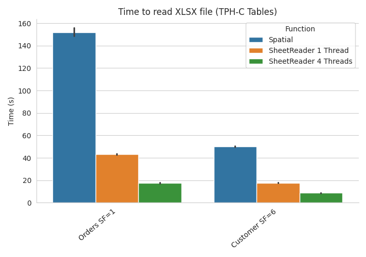

# SheetReader DuckDB extension

`sheetreader` is a DuckDB extension that allows reading XLSX files into DuckDB tables with SheetReader, our blazingly fast XLSX parser (https://github.com/polydbms/sheetreader-core).

---

This repository is based on https://github.com/duckdb/extension-template.

## Table of Contents

- [SheetReader DuckDB extension](#sheetreader-duckdb-extension)
  - [Table of Contents](#table-of-contents)
  - [Usage](#usage)
    - [Parameters](#parameters)
  - [More information on SheetReader](#more-information-on-sheetreader)
  - [Benchmarks](#benchmarks)
  - [Building yourself](#building-yourself)
    - [Running the extension](#running-the-extension)
  - [Installing pre-built binaries](#installing-pre-built-binaries)

## Usage

Example usage of the `sheetreader()` function with many of the available parameters set:

```sql
D CREATE TABLE test AS FROM sheetreader(
    'test.xlsx',
    sheet_index=1,
    threads=16,
    skip_rows=0,
    has_header=TRUE,
    types=[BOOLEAN,VARCHAR],
    coerce_to_string=TRUE,
    force_types=TRUE
  );
```

### Parameters

| Name               | Description                                                                                                                                                                                                                                                                                                                                                                                                                                                                                                                                                                                                                                                                |      Type       | Default                                                          |
| :----------------- | :------------------------------------------------------------------------------------------------------------------------------------------------------------------------------------------------------------------------------------------------------------------------------------------------------------------------------------------------------------------------------------------------------------------------------------------------------------------------------------------------------------------------------------------------------------------------------------------------------------------------------------------------------------------------- | :-------------: | :--------------------------------------------------------------- |
| `sheet_index`      | Index of the sheet to read. Starts at 1.                                                                                                                                                                                                                                                                                                                                                                                                                                                                                                                                                                                                                                   |    `INTEGER`    | `1`                                                              |
| `sheet_name`       | Name of the sheet to read. <br /> Only either `sheet_index` or `sheet_name` can be set.                                                                                                                                                                                                                                                                                                                                                                                                                                                                                                                                                                                    |    `VARCHAR`    | `""`                                                             |
| `threads`          | Number of threads to use, while parsing                                                                                                                                                                                                                                                                                                                                                                                                                                                                                                                                                                                                                                    |    `INTEGER`    | Half of available cores; minimum 1                               |
| `skip_rows`        | Number of rows to skip                                                                                                                                                                                                                                                                                                                                                                                                                                                                                                                                                                                                                                                     |    `INTEGER`    | `0`                                                              |
| `types`            | List of types for all columns <ul> <li> Types currently available:<br /> `VARCHAR`,`BOOLEAN`,`DOUBLE`, `DATE`.</li> <li> Useful in combination with `coerce_to_string` and `force_types`. </li> </ul>                                                                                                                                                                                                                                                                                                                                                                                                                                                                      | `LIST(VARCHAR)` | Uses types determined by first & second row (after skipped rows) |
| `coerce_to_string` | Coerce all cells in column of type `VARCHAR` to string (i.e. `VARCHAR`).                                                                                                                                                                                                                                                                                                                                                                                                                                                                                                                                                                                                   |    `BOOLEAN`    | `false`                                                          |
| `force_types`      | Use `types` even if they are not compatible with types determined by first/second row. <br /> Cells, that are not of the column type, are set to `NULL` or coerced to string, if option is set.                                                                                                                                                                                                                                                                                                                                                                                                                                                                            |    `BOOLEAN`    | `false`                                                          |
| `has_header`       | If set to `true`: <ul> <li> Force to treat first row as header row (only works if all cells are of type `VARCHAR`). </li> <li> If successful, the cell contents are used for column names. </li> <li> Will overwrite the default behavior, which doesn't use the first row as headers, if all columns have type `VARCHAR`. </li> </ul> <br /> If set to `false`: <ul>  <li> The extension will still try to treat the first row as header row. </li> <li> The difference is that it will not fail, if the first row is not usable (i.e. not all cells are of type `VARCHAR`). </li> <li> The first row won't be used as headers, if all columns have type `VARCHAR`. </ul> |    `BOOLEAN`    | `false`                                                          |


## More information on SheetReader

SheetReader was published in the [Information Systems Journal](https://www.sciencedirect.com/science/article/abs/pii/S0306437923000194).
```
@article{DBLP:journals/is/GavriilidisHZM23,
  author       = {Haralampos Gavriilidis and
                  Felix Henze and
                  Eleni Tzirita Zacharatou and
                  Volker Markl},
  title        = {SheetReader: Efficient Specialized Spreadsheet Parsing},
  journal      = {Inf. Syst.},
  volume       = {115},
  pages        = {102183},
  year         = {2023},
  url          = {https://doi.org/10.1016/j.is.2023.102183},
  doi          = {10.1016/J.IS.2023.102183},
  timestamp    = {Mon, 26 Jun 2023 20:54:32 +0200},
  biburl       = {https://dblp.org/rec/journals/is/GavriilidisHZM23.bib},
  bibsource    = {dblp computer science bibliography, https://dblp.org}
}
```

## Benchmarks

You can find benchmarks in the above-mentioned paper, comparing SheetReader to other XLSX parsers.

Here is a plot of preliminary benchmarks comparing the `sheetreader` DuckDB extension to the `spatial` extension's `st_read` function:




(*System info: 2x Intel(R) Xeon(R) E5530 @ 2.40GHz, 47GiB RAM*)

## Building yourself

First, clone this repository with the `--recurse-submodules` flag --- so you get all the needed source files.

To build the extension, run:
```sh
GEN=ninja make
```
The main binaries that will be built are:
```sh
./build/release/duckdb
./build/release/extension/sheetreader/sheetreader.duckdb_extension
```
- `duckdb` is the binary for the DuckDB shell with the extension code automatically loaded.
- `sheetreader.duckdb_extension` is the loadable binary as it would be distributed.

### Running the extension

To run the self-built extension code, simply start the shell with `./build/release/duckdb`.

## Installing pre-built binaries

To install your extension binaries from S3, you will need to do two things. Firstly, DuckDB should be launched with the
`allow_unsigned_extensions` option set to true. How to set this will depend on the client you're using. Some examples:

CLI:
```shell
duckdb -unsigned
```

Python:
```python
con = duckdb.connect(':memory:', config={'allow_unsigned_extensions' : 'true'})
```

NodeJS:
```js
db = new duckdb.Database(':memory:', {"allow_unsigned_extensions": "true"});
```

Get the extension from S3 (platform is either `linux_amd64`, `linux_amd64_gcc4`, `linux_arm64`, `osx_arm64`, `osx_amd64`, `windows_amd64`, `wasm_eh`, `wasm_mvp`, `wasm_threads`):

```
wget https://duckdb-sheetreader-extension.s3.eu-central-1.amazonaws.com/v1.0.0/<platform>/sheetreader.duckdb_extension.gz
```


At the moment the metadata mechanic doesn't work, so you have to prepare the extension for loading:

```bash
gzip -d sheetreader.duckdb_extension.gz
truncate -s -256 sheetreader.duckdb_extension # Delete metadata
```

<!-- Secondly, you will need to set the repository endpoint in DuckDB to the HTTP url of your bucket + version of the extension -->
<!-- you want to install. To do this run the following SQL query in DuckDB: -->
<!-- ```sql
SET custom_extension_repository='bucket.s3.eu-west-1.amazonaws.com/<your_extension_name>/latest';
```
Note that the `/latest` path will allow you to install the latest extension version available for your current version of
DuckDB. To specify a specific version, you can pass the version instead. -->

After running these steps, you can install and load the extension using the regular `INSTALL`/`LOAD`commands in DuckDB:
```sql
D FORCE INSTALL './sheetreader.duckdb_extension';
D LOAD sheetreader;
```

Now we can use the features from the extension directly in DuckDB. The extension contains a table function `sheetreader()` that takes the path of an .XLSX file and returns a table:
```sql
D FROM sheetreader('data.xlsx');
```
